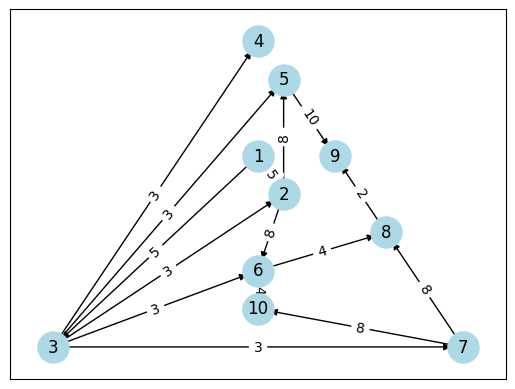
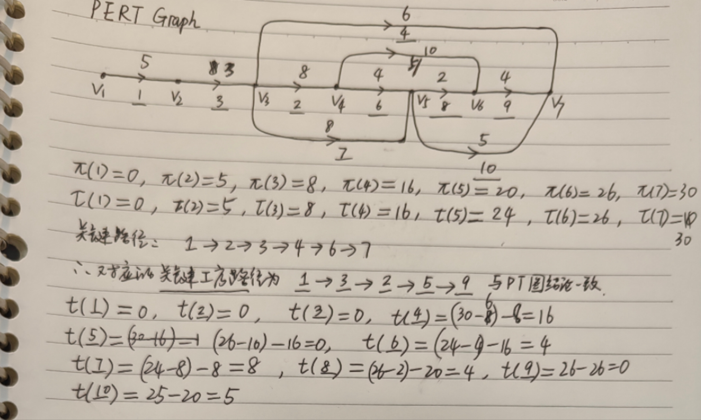

## 离散（2）hw7

> 王子轩 `2023011307`
>
> `wang-zx23@mails.tsinghua.edu.cn`

### P56 T45

```txt
==================================================
    工序        耗时            前驱工序        
--------------------------------------------------
    1         5              -          
    2         8             1,3         
    3         3              1          
    4         6              3          
    5         10            2,3         
    6         4             2,3         
    7         8              3          
    8         2             6,7         
    9         4             5,8         
    10        5             6,7         
==================================================
```

#### PT图求解

代码在如下仓库中

```txt
https://github.com/wannabeyourfriend/THU-CST-DM2-2025spring/blob/main/Labs/critical_path
```

绘制pT图并进行拓扑排序
$$
1 \to 3 \to 2 \to 4 \to 7 \to 5 \to 6 \to 8 \to 10 \to 9
$$

$$
\text{From } 2 \to n:\\
\pi(v_j) = \text{max}_{v_i \in \text{prev}(v_j)}[\pi(v_i) + w(v_i, v_j)]\\
\text{From } (n-1) \to 1:\\
\tau(v_j) = \text{min}_{v_i \in \text{next}(v_j)}(\tau(v_i) - w(v_j, v_i))
$$

```txt
=========================================================================
    工序       最早启动时间(\pi)      最晚启动时间(\tau)     允许延误时间(t=\pi -\tau)  
-------------------------------------------------------------------------
    1            0              0              0       
    2            8              8              0       
    3            5              5              0       
    4            8             24             16       
    5           16             16              0       
    6           16             20              4       
    7            8             16              8       
    8           20             24              4       
    9           26             26              0       
    10          20             25              5       
=========================================================================
```

关键路径为
$$
1 \to 3 \to 2 \to 5 \to 9
$$
 

工序3, 5, 10的允许延误时间分别为0, 0, 5

#### PERT图求解

代码绘制出来有点问题，因此如下手绘PERT图，计算各关系节点的$\pi,\tau$，在此基础上计算每个工序边的允许延误$t$



可以看到根据PERT图计算得到的结果与PT图是一致的。

### P57 T47

解：

```python
def topology_sort(graph):
    in_degree = {u: 0 for u in graph}
    for u in graph:
        for v in graph[u]:
            in_degree[v] = in_degree.get(v, 0) + 1
    queue = [u for u in graph if in_degree[u] == 0]
    sorted_vertices = []
    while queue:
        u = queue.pop(0)
        sorted_vertices.append(u)
        for v in graph[u]:
            in_degree[v] -= 1
            if in_degree[v] == 0:
                queue.append(v)
    if len(sorted_vertices) != len(graph):
        return None
    return sorted_vertices
```

拓扑序答案不唯一, 这里给出由代码产生的一种合法拓扑序

- (1) $v_{0} \to v_{3} \to v_{7} \to v_{2} \to v_{4} \to v_{5} \to v_{6} \to v_{8} \to v_{1} \to v_{9} \to v_{10}$

- (2) $v_{8} \to v_{2} \to v_{12} \to v_{6} \to v_{1} \to v_{13} \to v_{7} \to v_{10} \to v_{3} \to v_{11} \to v_{4} \to v_{9} \to v_{5}$

