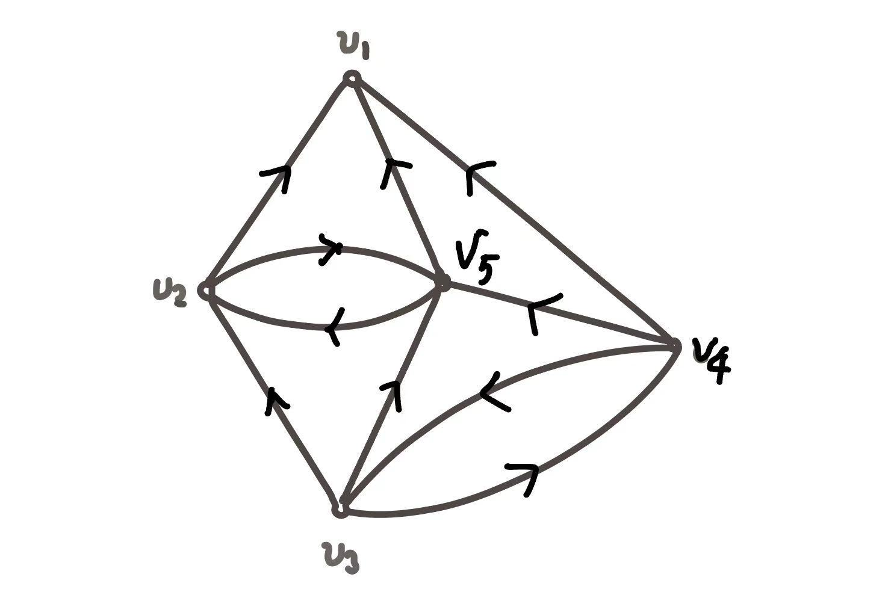
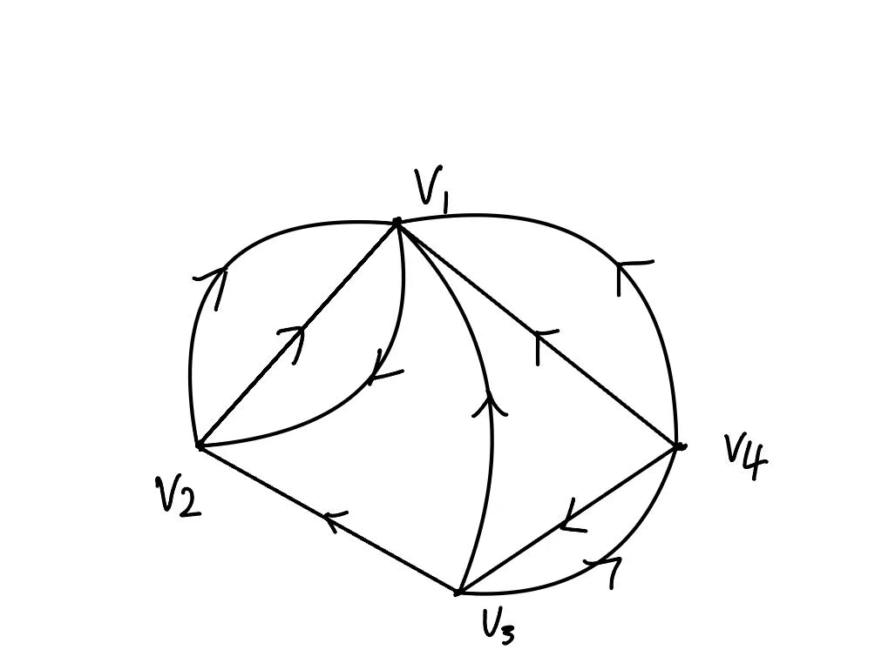

## 离散(2) hw8

> 王子轩 `2023011307`
>
> `wang-zx23@mails.tsinghua.edu.cn`

### P82 T1

> 一颗树有$n_2$个顶点为2度的节点,$n_3$个顶点的度为3的节点,$\cdots n_k$个顶点度为$k$的节点.问有多少个度为1的顶点.

解:设度为1的顶点有 $n_1$个,则根据树的性质,有$\sum_{i}d(v_i) = 2(\sum_{i}v_i - 1)$, 所以有$n_1 + 2\times n_2 + \cdots + k\times n_k = 2(n_1 + n_2 + \cdots n_k -1)$

解得:$n_1 = n_3 + 2n_4 + 3n_5 + \cdots + (k -2)n_k + 2$

### P82 T9

> 设 $G=(V,E)$ 为有向连通图,$e$ 是 $G$ 的一条边.证明:

##### Lemma

任何无向连通图都至少存在一棵支撑树.此题目中的有向联通图的支撑树只需要满足支撑子图+树的定义,因此也满足引理.

(1) 若 $e$ 不在 $G$ 的任何一颗支撑树中,则 $e$ 为自环. 

解:我们采用反证法,假设 $e = (u, v)$ 不在任何一颗支撑树中,且不为自环.若 $e$ 是割边,则显然矛盾,因为支撑树 $T$ 经过图 $G$ 中的所有顶点是连通的,因此一定有支撑树边经过 $e$.若 $e$ 不是割边,我们也可以如下说明 $\exist T'  \text{s.t.}e \in E(T')$ : 由**Lemma**有向连通图一定存在支撑树,不妨假设存在一个生成树 $T$  不包含 $ e$ .向 $T$ 中添加 $e$,此时会形成一个环 $C$(因为原本连通,添加 $e$ 后引入了冗余路径), 环 $C$ 中至少包含边 $e$ 和另一条连接 $u$ 与 $v$  的路径 $P$, 则 $\exist f \in E(P)$ 从 $T \cup \{e\}$中 删除边 $f$ 得到 $T' = (T \cup \{e\}) - \{f\}$ 删除环上的边 $f$ 不会破坏连通性, 且该操作后 $T'$ 中无环.且 $|E(T')| = |V|- 1$ 是图 $G$ 的支撑树,因此 $e$ 在支撑树 $T'$ 中,与假设矛盾.从而,若 $e$ 不在 $G$ 的任何一颗支撑树中,则 $e$ 为自环.

(2) 若 $e$ 在 $G$ 的每个支撑树中,则 $e$ 为割边.

解:采用反证法.假设 $e$ 在 $G$ 的每个支撑树中但 $e$ 不为割边,则在图 $G$ 中删去 $e$ 得到 $G' = G - \{e\}$ 也是连通图,那么 $G'$ 一定也存在支撑树 $T'$ ,同时 $T'$ 也是 $G$ 的支撑树且不包括 $e$ 因此矛盾

### P83 T16

> 求P83 图3.27中(1)树的数目(2) 必含 $(v_1, v_5)$ 的树的数目(3)不含 $(v_4, v_5)$ 的树的数目

解:

太长不看版:

(1) 101 (2) 44 (3) 60

对于无向图,先对每个边赋予一个方向



|      | (1,2) | (1,4) | (1,5) | (2,3) | (2,5) | (2,5) | (3,5) | (3,4) | (3,4) | (4,5) |
| ---- | ----- | ----- | ----- | ----- | ----- | ----- | ----- | ----- | ----- | ------- |
| v1   | -1    | -1    | -1    | 0     | 0     | 0     | 0     | 0     | 0     | 0       |
| v2   | 1     | 0     | 0     | -1    | 1     | -1    | 0     | 0     | 0     | 0       |
| v3   | 0     | 0     | 0     | 1     | 0     | 0     | 1     | 1     | -1    | 0       |
| v4   | 0     | 1     | 0     | 0     | 0     | 0     | 0     | -1    | 1     | 1       |
| v5   | 0     | 0     | 1     | 0     | -1    | 1     | -1    | 0     | 0     | -1      |

(1)树的数目

```python
import numpy as np
B_5 = np.array([
    [-1,-1,-1, 0, 0, 0, 0, 0, 0, 0],
    [ 1, 0, 0,-1, 1,-1, 0, 0, 0, 0],
    [ 0, 0, 0, 1, 0, 0, 1, 1,-1, 0],
    [ 0, 1, 0, 0, 0, 0, 0,-1, 1, 1]
])
B_5_T = B_5.T
BB = B_5_B_5_T = np.dot(B_5, B_5_T)
print("B_5_B_5_T=\n",BB)
determinant = np.linalg.det(B_5_B_5_T)
print("det(B_5 B_5^T) =", int(determinant))
"""
output:
B_5_B_5_T=
 [[ 3 -1  0 -1]
 [-1  4 -1  0]
 [ 0 -1  4 -2]
 [-1  0 -2  4]]
det(B_5 B_5^T) = 101
"""
```

$det(B_5B_5^T)=101$ 

(2)必含 $(v_1, v_5)$ 的树的数目:

可以将 $(v_1,v_5)$ 视为一个点



|      | (1,2) | (1,2) | (1,2) | (1,3) | (1,4) | (1,4) | (2,3) | (3,4) | (3,4) |
| ---- | ----- | ----- | ----- | ----- | ----- | ----- | ----- | ----- | ----- |
| v1   | -1    | -1    | 1     | -1    | -1    | -1    | 0     | 0     | 0     |
| v2   | 1     | 1     | -1    | 0     | 0     | 0     | -1    | 0     | 0     |
| v3   | 0     | 0     | 0     | 1     | 0     | 0     | 1     | -1    | 1     |
| v4   | 0     | 0     | 0     | 0     | 1     | 1     | 0     | 1     | -1    |

```python
import numpy as np
B_3 = np.array([
    [-1, -1, 1, -1, -1, -1, 0, 0, 0],
    [1, 1, -1, 0, 0, 0, -1, 0, 0],
    [0, 0, 0, 1, 0, 0, 1, -1, 1]
])
B_3_T = B_3.T
B_3_B_3_T = np.dot(B_3, B_3_T)
BB = np.dot(B_3, B_3_T)
print("B_3_B_3_T=\n",BB)
determinant = np.linalg.det(B_3_B_3_T)
print("det(B_3 B_3^T) =", round(determinant))
"""
output:
B_3_B_3_T=
 [[ 6 -3 -1]
 [-3  4 -1]
 [-1 -1  4]]
det(B_3 B_3^T) = 44
"""
```

$det(B_3B_3^T) = 44$

或者采用反向法,先计算去除了$(v_1,v_5)$的关联矩阵

|      | (1,2) | (1,4) | (2,3) | (2,5) | (2,5) | (3,5) | (3,4) | (3,4) | (4,5) |
| ---- | ----- | ----- | ----- | ----- | ----- | ----- | ----- | ----- | ----- |
| v1   | -1    | -1    | 0     | 0     | 0     | 0     | 0     | 0     | 0     |
| v2   | 1     | 0     | -1    | 1     | -1    | 0     | 0     | 0     | 0     |
| v3   | 0     | 0     | 1     | 0     | 0     | 1     | 1     | -1    | 0     |
| v4   | 0     | 1     | 0     | 0     | 0     | 0     | -1    | 1     | 1     |
| v5   | 0     | 0     | 0     | -1    | 1     | -1    | 0     | 0     | -1    |

```python
import numpy as np
B_5 = np.array([
    [-1,-1, 0, 0, 0, 0, 0, 0, 0],
    [ 1, 0,-1, 1,-1, 0, 0, 0, 0],
    [ 0, 0, 1, 0, 0, 1, 1,-1, 0],
    [ 0, 1, 0, 0, 0, 0,-1, 1, 1]
])
B_5_T = B_5.T
BB = B_5_B_5_T = np.dot(B_5, B_5_T)
print("B_5_B_5_T=\n",BB)
determinant = np.linalg.det(B_5_B_5_T)
print("det(B_5 B_5^T) =", round(determinant))
"""
output:
B_5_B_5_T=
 [[ 2 -1  0 -1]
 [-1  4 -1  0]
 [ 0 -1  4 -2]
 [-1  0 -2  4]]
det(B_5 B_5^T) = 57
"""
```

符合要求的树的数目=101-57=44

(3) 不含 $(v_4, v_5)$ 的树的数目

|      | (1,2) | (1,4) | (1,5) | (2,3) | (2,5) | (2,5) | (3,5) | (3,4) | (3,4) |
| ---- | ----- | ----- | ----- | ----- | ----- | ----- | ----- | ----- | ----- |
| v1   | -1    | -1    | -1    | 0     | 0     | 0     | 0     | 0     | 0     |
| v2   | 1     | 0     | 0     | -1    | 1     | -1    | 0     | 0     | 0     |
| v3   | 0     | 0     | 0     | 1     | 0     | 0     | 1     | 1     | -1    |
| v4   | 0     | 1     | 0     | 0     | 0     | 0     | 0     | -1    | 1     |
| v5   | 0     | 0     | 1     | 0     | -1    | 1     | -1    | 0     | 0     |

```python
import numpy as np
B_5 = np.array([
    [-1,-1,-1, 0, 0, 0, 0, 0, 0],
    [ 1, 0, 0,-1, 1,-1, 0, 0, 0],
    [ 0, 0, 0, 1, 0, 0, 1, 1,-1],
    [ 0, 1, 0, 0, 0, 0, 0,-1, 1],
])
B_5_T = B_5.T
BB = B_5_B_5_T = np.dot(B_5, B_5_T)
print("B_5_B_5_T=\n",BB)
determinant = np.linalg.det(B_5_B_5_T)
print("det(B_5 B_5^T) =", round(determinant))
"""
output:
B_5_B_5_T=
 [[ 3 -1  0 -1]
 [-1  4 -1  0]
 [ 0 -1  4 -2]
 [-1  0 -2  3]]
det(B_5 B_5^T) = 60
"""
```

符合要求的树的数目为60
