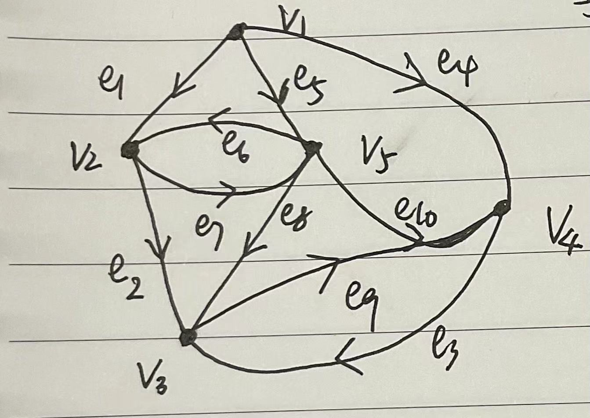
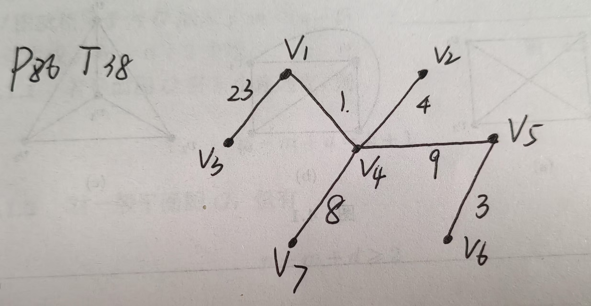
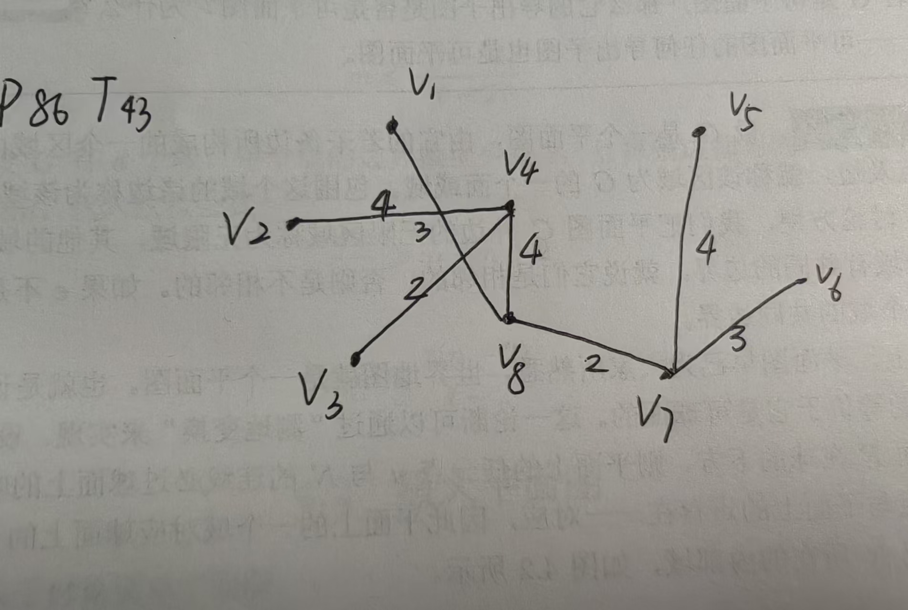

## 离散(2) hw9

> 王子轩 `2023011307`
>
> `wang-zx23@mails.tsinghua.edu.cn`

### P83 T2

> 求图`3.28`中，以(1)$v_1$为根的根树的数目 (2)以$v_1$为根，不含有$(v_1,v_5)$的根树的数目 (3)以$v_1$为根，不含有$(v_2,v_3)$的数目

解：



（1）

构造有向图的关联矩阵$B$：
$$
B = \begin{bmatrix}
   1 & 0 & 0 & 1 & 1 & 0 & 0 & 0 & 0 & 0 \\
   -1 & 1 & 0 & 0 & 0 & -1 & 1 & 0 & 0 & 0 \\
   0 & -1 & -1 & 0 & 0 & 0 & 0 & -1 & 1 & 0 \\
   0 & 0 & 1 & -1 & 0 & 0 & 0 & 0 & -1 & -1 \\
   0 & 0 & 0 & 0 & -1 & 1 & -1 & 1 & 0 & 1
   \end{bmatrix}
$$
造基本关联矩阵$B_1$（去除第一行)
$$
B_1 = \begin{bmatrix}
   -1 & 1 & 0 & 0 & 0 & -1 & 1 & 0 & 0 & 0 \\
   0 & -1 & -1 & 0 & 0 & 0 & 0 & -1 & 1 & 0 \\
   0 & 0 & 1 & -1 & 0 & 0 & 0 & 0 & -1 & -1 \\
   0 & 0 & 0 & 0 & -1 & 1 & -1 & 1 & 0 & 1
   \end{bmatrix}
$$
构造变换矩阵$\vec{B_1}$（将$B_1$中所有的1替换为0）
$$
\vec{B_1} = \begin{bmatrix}
   -1 & 0 & 0 & 0 & 0 & -1 & 0 & 0 & 0 & 0 \\
   0 & -1 & -1 & 0 & 0 & 0 & 0 & -1 & 0 & 0 \\
   0 & 0 & 0 & -1 & 0 & 0 & 0 & 0 & -1 & -1 \\
   0 & 0 & 0 & 0 & -1 & 0 & -1 & 0 & 0 & 0
   \end{bmatrix}
$$
计算$\vec{B_1} \cdot B_1^T$
$$
\vec{B_1}  \cdot B_1^T = \begin{bmatrix}
   2 & 0 & 0 & -1 \\
   -1 & 3 & -1 & -1 \\
   0 & -1 & 3 & -1 \\
   -1 & 0 & 0 & 2
   \end{bmatrix}
$$

$$
det(\vec{B_1} \cdot B_1^T) = 24
$$


因此，以$v_1$为根的根树的数目为24

（2）

从关联矩阵中删除边$(v_1,v_5)$对应的列。

构造基本关联矩阵$B_1$
$$B_1 = \begin{bmatrix}
-1 & 1 & 0 & 0 & 0 & -1 & 1 & 0 & 0 & 0 \\
0 & -1 & -1 & 0 & 0 & 0 & 0 & -1 & 1 & 0 \\
0 & 0 & 1 & -1 & 0 & 0 & 0 & 0 & -1 & -1 \\
0 & 0 & 0 & 0 & -1 & 1 & -1 & 1 & 0 & 1
\end{bmatrix}$$

删除边$(v_1,v_5)$对应的列（第5列）：
$$B_1' = \begin{bmatrix}
-1 & 1 & 0 & 0 & -1 & 1 & 0 & 0 & 0 \\
0 & -1 & -1 & 0 & 0 & 0 & -1 & 1 & 0 \\
0 & 0 & 1 & -1 & 0 & 0 & 0 & -1 & -1 \\
0 & 0 & 0 & 0 & 1 & -1 & 1 & 0 & 1
\end{bmatrix}$$

构造变换矩阵$\vec{B_{1}'}$（将$B_1'$中所有的1替换为0）：
$$\vec{B_1}' = \begin{bmatrix}
-1 & 0 & 0 & 0 & -1 & 0 & 0 & 0 & 0 \\
0 & -1 & -1 & 0 & 0 & 0 & -1 & 0 & 0 \\
0 & 0 & 0 & -1 & 0 & 0 & 0 & -1 & -1 \\
0 & 0 & 0 & 0 & 0 & -1 & 0 & 0 & 0
\end{bmatrix}$$

1. 计算$\vec{B_1}'  \cdot (B_1')^T$：
   $$\vec{B_1}'  \cdot (B_1')^T = \begin{bmatrix}
   2 & 0 & 0 & -1 \\
   -1 & 3 & -1 & -1 \\
   0 & -1 & 3 & -1 \\
   -1 & 0 & 0 & 1
   \end{bmatrix}$$

2. 计算行列式：
   $$\vec{B_1'} \cdot B_1'^T = 8$$

因此，以$v_1$为根，不含有$(v_1,v_5)$的根树的数目为8。

（3）

```python
import numpy as np
# 有向图的关联矩阵
B = np.array([
[ 1, 0, 0, 1, 1, 0, 0, 0, 0, 0],
[-1, 1, 0, 0, 0,-1, 1, 0, 0, 0],
[ 0,-1,-1, 0, 0, 0, 0,-1, 1, 0],
[ 0, 0, 1,-1, 0, 0, 0, 0,-1,-1],
[ 0, 0, 0, 0,-1, 1,-1, 1, 0, 1]
])
B_1 = B[1:5]
B_1_v = np.where(B_1 == 1, 0, B_1)
det_all = np.linalg.det(B_1_v.dot(B_1.T))
print("以v_1为根的所有根树数目 =", round(det_all))
B_1_no_v2v3 = np.delete(B_1, 2, axis=1)
B_1_v_no_v2v3 = np.where(B_1_no_v2v3 == 1, 0, B_1_no_v2v3)
det_no_v2v3 = np.linalg.det(B_1_v_no_v2v3.dot(B_1_no_v2v3.T))
print("以v_1为根不含(v_2,v_3)边的根树数目 =", round(det_no_v2v3))
det_with_v2v3 = det_all - det_no_v2v3
print("以v_1为根必含(v_2,v_3)边的根树数目 =", round(det_with_v2v3))
### 
"""
以v_1为根的所有根树数目 = 24
以v_1为根不含(v_2,v_3)边的根树数目 = 18
以v_1为根必含(v_2,v_3)边的根树数目 = 6
"""
```

### P85 T27

> 已知图$G$的基本关联矩阵，求解以$\{e_3, e_4, e_6, e_7\}$为树的基本关联矩阵

解：
$$
B = \begin{bmatrix}
-1 & 1 & 0 & 0 & 0 & 1 & 0 & 0 \\
1 & 0 & 0 & 1 & 1 & 0 & 0 & 0 \\
0 & -1 & -1 & 0 & 0 & 0 & -1 & 0 \\
0 & 0 & 1 & -1 & 0 & 0 & 0 & -1
\end{bmatrix}
$$
给定树边为$e_3, e_4, e_6, e_7$，对应矩阵$B_5$的第3、4、6、7列。
弦边为$e_1, e_2, e_5, e_8$，对应矩阵$B_5$的第1、2、5、8列。

树矩阵$B_{11}$：
$$B_{11} = \begin{bmatrix}
0 & 0 & 1 & 0 \\
0 & 1 & 0 & 0 \\
-1 & 0 & 0 & -1 \\
1 & -1 & 0 & 0
\end{bmatrix}$$

余树边矩阵$B_{12}$：
$$B_{12} = \begin{bmatrix}
-1 & 1 & 0 & 0 \\
1 & 0 & 1 & 0 \\
0 & -1 & 0 & 0 \\
0 & 0 & 0 & -1
\end{bmatrix}$$

$$B_{12}^{-T} = \begin{bmatrix}
0 & 1 & 0 & 1 \\
0 & 1 & 0 & 0 \\
1 & 0 & 0 & 0 \\
0 & -1 & -1 & -1
\end{bmatrix}$$

$$C_{f12} = B_{11}^T B_{12}^{-T} = \begin{bmatrix}
0 & 0 & 0 & 1 \\
1 & -1 & 0 & -1 \\
0 & -1 & 0 & 0 \\
0 & -1 & -1 & -1
\end{bmatrix}$$


### P86 T38

> 求解赋权图中的最小通信代价

解：

使用Prim算法，计算城市节点图的最小生成树，实现的算法代码如下：

```python
import numpy as np
import matplotlib.pyplot as plt
def prim(graph):
    n = len(graph) 
    visited = [False] * n  # 记录顶点是否已加入MST
    key = [float('inf')] * n  # 记录每个顶点到MST的最小权重
    parent = [-1] * n  # 记录每个顶点在MST中的父节点
    key[0] = 0
    for _ in range(n):
        min_key = float('inf')
        min_index = -1
        for i in range(n):
            if not visited[i] and key[i] < min_key:
                min_key = key[i]
                min_index = i
        visited[min_index] = True
        for i in range(n):
            if (graph[min_index][i] > 0 and  # 存在边
                not visited[i] and  # 顶点未访问
                graph[min_index][i] < key[i]):  # 权重更小
                key[i] = graph[min_index][i]
                parent[i] = min_index
    mst = []
    for i in range(1, n):
        mst.append((parent[i], i, graph[parent[i]][i]))
    
    return mst
```

给出方案：

在$v_3 -v_1, v_1 - v_4, v_4-v_2, v_4 - v_5, v_5-v_6, v_4 - v_7$之间假设通信线路



总最小代价为48

### P86 T43

> 求解图上的最短树

解：算法同上，使用Prim算法



### 附录

```python
### P86 T38
def create_example_graph():
    n = 8
    graph = np.zeros((n, n))
    edges = [
        (4, 3, 36),
        (4, 1, 1),  
        (4, 2, 4),
        (4, 5, 9),
        (4, 6, 16),
        (4, 7, 8),
        (1, 2, 20),
        (2, 5, 15),
        (5, 6, 3),
        (6, 7, 17),
        (7, 3, 28),
        (3, 1, 23),
    ]
    
    for u, v, w in edges:
        graph[u][v] = w
        graph[v][u] = w 
    
    return graph

def main():
    graph = create_example_graph()
    mst = prim(graph)
    print("\n最小生成树的边:")
    total_weight = 0
    for u, v, weight in mst:
        print(f"边 {u}-{v}: 权重 = {weight}")
        total_weight += weight
    print(f"最小生成树总权重: {total_weight}")
    
main()
### output
"""
最小生成树的边:
边 4-1: 权重 = 1.0
边 4-2: 权重 = 4.0
边 1-3: 权重 = 23.0
边 7-4: 权重 = 8.0
边 4-5: 权重 = 9.0
边 5-6: 权重 = 3.0
边 7-7: 权重 = 0.0
最小生成树总权重: 48.0
"""
### P43 T43

def create_example_graph():
    n = 9
    graph = np.zeros((n, n))
    edges = [
        (1, 2, 5),
        (1, 8, 3),
        (2, 4, 4),
        (2, 3, 7),
        (3, 1, 6),
        (4, 1, 4),
        (4, 3, 2),
        (4, 6, 5),
        (4, 8, 4),
        (5, 4, 7),
        (5, 7, 4),
        (6, 5, 5),
        (7, 6, 3),
        (8, 3, 5),
        (8, 7, 2),        
    ]
    
    for u, v, w in edges:
        graph[u][v] = w
        graph[v][u] = w 
    
    return graph

def main():
    graph = create_example_graph()
    mst = prim(graph)
    print("\n最小生成树的边:")
    total_weight = 0
    for u, v, weight in mst:
        print(f"边 {u}-{v}: 权重 = {weight}")
        total_weight += weight
    print(f"最小生成树总权重: {total_weight}")

# 运行主函数
main()
### output
"""
最小生成树的边:
边 8-1: 权重 = 3.0
边 4-2: 权重 = 4.0
边 4-3: 权重 = 2.0
边 8-4: 权重 = 4.0
边 7-5: 权重 = 4.0
边 7-6: 权重 = 3.0
边 8-7: 权重 = 2.0
边 8-8: 权重 = 0.0
最小生成树总权重: 22.0
"""
```

最短树如下图所示：


