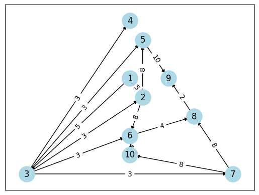

## 离散（2）hw7

> 王子轩 `2023011307`
>
> `wang-zx23@mails.tsinghua.edu.cn`

### P56 T45

```txt
==================================================
    工序        耗时            前驱工序        
--------------------------------------------------
    1         5              -          
    2         8             1,3         
    3         3              1          
    4         6              3          
    5         10            2,3         
    6         4             2,3         
    7         8              3          
    8         2             6,7         
    9         4             5,8         
    10        5             6,7         
==================================================
```

#### PT图求解

绘制PT图并进行拓扑排序
$$
1 \to 3 \to 2 \to 4 \to 7 \to 5 \to 6 \to 8 \to 10 \to 9
$$

$$
\text{From } 2 \to n:\\
p(v_j) = \text{max}_{v_i∈prev(v_j)}[p(v_i) + w(v_i, v_j)]\\
\text{From } (n-1) \to 1:\\
t(v_j) = \text{min}_{v_i∈next(v_j)}(t(v_i) - w(v_j, v_i))\\
$$

```txt
=========================================================================
    工序       最早启动时间(p)      最晚启动时间(t)     允许延误时间(p-t)  
-------------------------------------------------------------------------
    1            0              0              0       
    2            8              8              0       
    3            5              5              0       
    4            8             24             16       
    5           16             16              0       
    6           16             20              4       
    7            8             16              8       
    8           20             24              4       
    9           26             26              0       
    10          20             25              5       
=========================================================================
```

关键路径为
$$
1 \to 3 \to 2 \to 5 \to 9
$$
